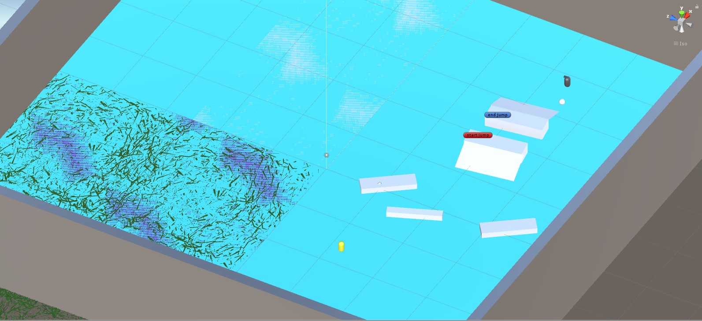

# First Person Shooter game on Unity 3D

* According to the tutorial from [GeekBrains youtube chanel](https://www.youtube.com/watch?v=O01yCLKQKS8)

### TODO:
* do movenemnt of the enemy with Impulse (equal the movement of the player)
* enemy start attack to player
* death of the player
